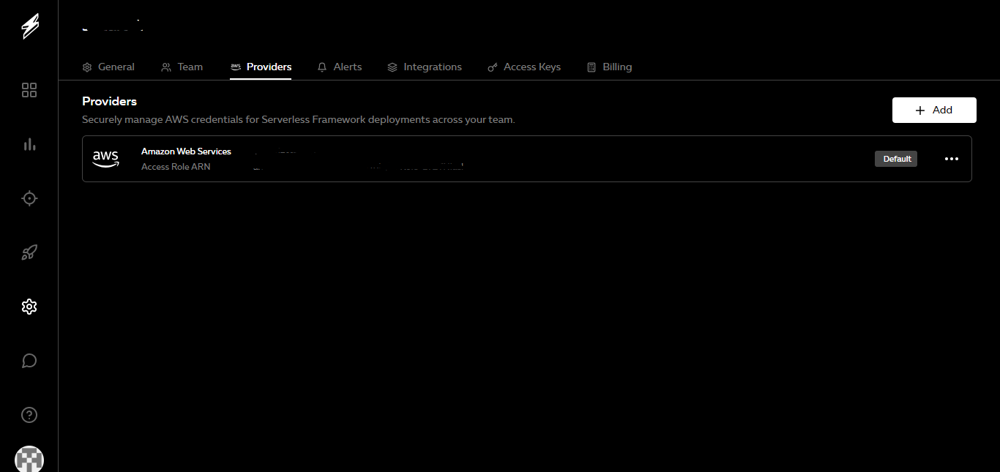

# Project Description

The functions have been developed using serverless framework. So in order to run this project the following requirement must be met:

1. Serverless Dashboard Account, AWS Account, considering minimal config con be run through root account.
2. Connect Serverless dashboard to your aws account. Use the Add button to add a provider or connect to AWS account.

3. Once the account is connected then configure the repository for the serverless steps are available at https://stackoverflow.com/questions/46128469/aws-lambda-serverless-deploy-asking-for-aws-provider-credentials 
4. And the repo is configured then must login into your serverless from commandline by using the `serverless login` command for this the serverless must be installed globally on the server
5. Create an S3 bucket with the name of the `serverless-assn` so that the function starts dumping the file into the S3 bucket.
6. If you reached this step then only thing required here is to run `npm i` and `npm run deploy` to deploy to serverless or `npm run local` to test the function locally.